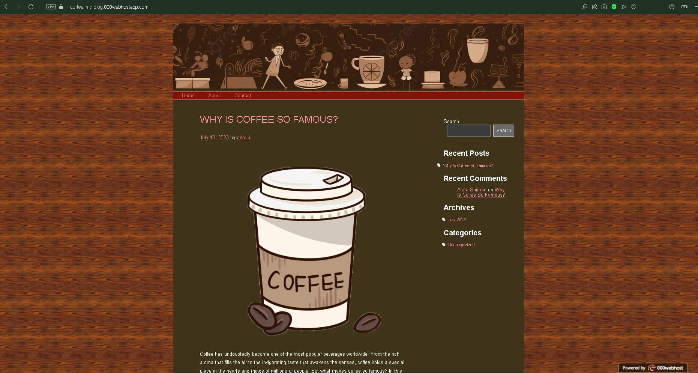
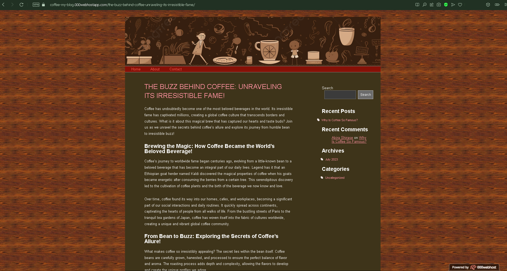
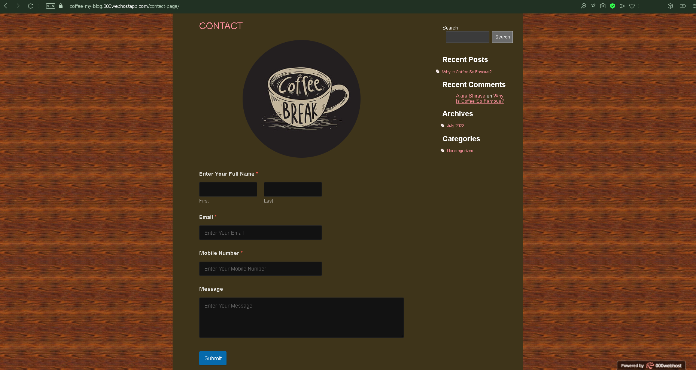

# Coffee Website Blog

**Note:** This is my first time creating a WordPress website for my coffee blog.

Welcome to my Coffee Website Blog! This repository showcases my WordPress-powered coffee blog, which serves as a demonstration of my skills and expertise in web development.

## Introduction

This website blog is all about "WHY IS COFFEE SO FAMOUS?".

## Hosting

I tried hosted it on 000webhost.com, a free hosting platform. It provides a reliable and convenient environment to showcase the blog and make it accessible to visitors from anywhere.

## Plugins Used

The following plugins were utilized to enhance the functionality of this website:

- Remove Footer Credit: This plugin allows for customization of the footer credit section.
- WP Reset: This plugin provides a quick and easy way to reset the WordPress database to its default settings.
- WP Forms Lite: This plugin enables the creation and management of contact forms on the website.
- All-in-One WP Migration: This plugin simplifies the migration of the WordPress site, including its database, media files, plugins, and themes.

Please note that this repository serves as a portfolio to demonstrate my skills and the capabilities of my coffee website blog. The purpose is to showcase my proficiency in WordPress development and my ability to create engaging and informative websites.

